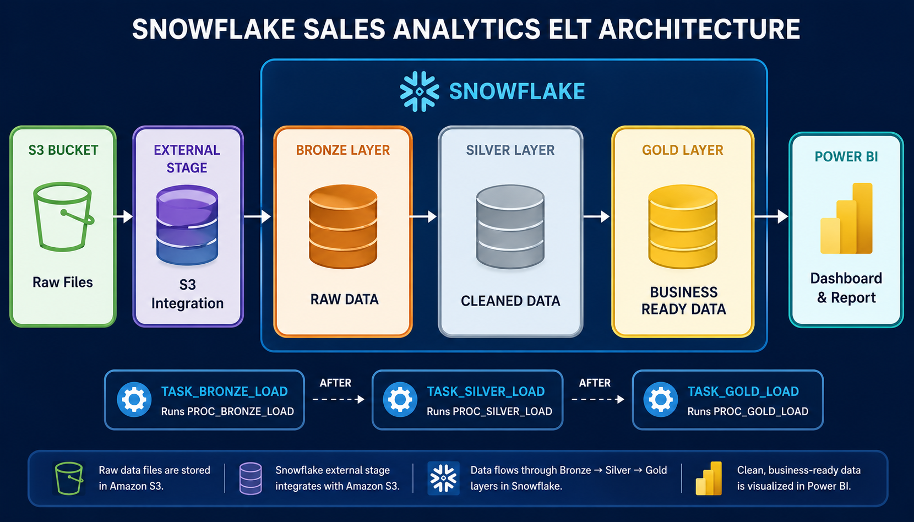
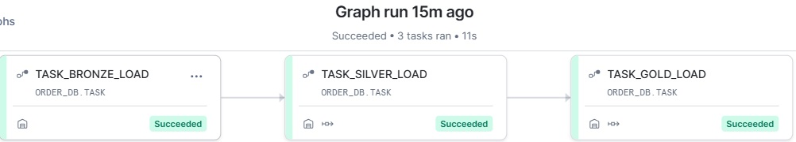

# End-to-End Snowflake Sales ELT Pipeline with Amazon S3, Streams, Tasks & Power BI

### Overview

This project demonstrates the implementation of a modern ELT (Extract, Load, Transform) pipeline using Snowflake as the cloud data warehouse, Amazon S3 as the data source, and Power BI as the reporting platform.

The pipeline follows the Medallion Architecture (Bronze → Silver → Gold), enabling scalable, incremental, and automated data processing using Snowflake Streams, Stored Procedures, and Task Chaining.

This solution intentionally uses COPY INTO instead of Snowpipe to demonstrate scheduled batch ingestion and orchestration.

### Project Architecture

### Technology Stack
| Technology | Purpose |
|-----------|------------|
| Snowflake |	Cloud Data Warehouse |
| Amazon S3	| Source Data Storage |
| SQL	      | Data Transformation |
| Streams	  | Incremental Data Processing |
| Tasks	    | Workflow Orchestration |
| Stored Procedures	| Business Logic |
| COPY INTO	| Batch Data Ingestion |
| External Stage | Access S3 Files |
| Storage Integration |	Secure AWS Connection |
| Power BI	| Reporting & Visualization |

### Dataset
The source dataset consists of customer order transactions stored as CSV files in Amazon S3.
- Fields
- Order ID
- Customer Name
- Order Date
- Delivery Date
- Item Type
- Quantity
- Order Status
- Shipping Method
- Unit Price
- Region
- Discount

Additional audit columns are added during ingestion:

- Source File Name
- Load Timestamp

### Project Objectives
- Build a complete ELT pipeline in Snowflake.
- Implement Medallion Architecture.
- Demonstrate incremental processing using Streams.
- Automate workflows using Snowflake Tasks.
- Build a dimensional model for analytics.
- Create an interactive Power BI dashboard.

### Bronze Layer (Raw Layer)

#### Purpose
The Bronze layer stores the raw data exactly as received from Amazon S3.

#### Components
- External Stage
- Storage Integration
- File Format
- Raw Table
- COPY INTO
- Bronze Stream
- Bronze Stored Procedure
- Bronze Task
#### Key Activities
- Load CSV files from Amazon S3.
- Preserve original data.
- Capture metadata.
- Track source files.
- Store ingestion timestamps.

### Silver Layer (Transformation Layer)

#### Purpose
The Silver layer cleans and standardizes the raw data.

#### Transformations
- Remove leading and trailing spaces.
- Standardize text values.
- Filter invalid records.
- Calculate Delivery Days.
- Handle null values.
- Remove inconsistent formatting.
- Merge incremental changes.

#### Components
- Clean Table
- Stream
- Stored Procedure
- Task

### Gold Layer (Business Layer)
The Gold layer transforms transactional data into a Star Schema optimized for reporting.

#### Dimension Tables
#### DIM_CUSTOMER
Contains unique customers.

Column
Customer ID
Customer Name
ETL Timestamp

#### DIM_ITEM
Contains unique products/items.

Column
Item ID
Item Type
ETL Timestamp

#### DIM_REGION
Contains unique regions.

Column
Region ID
Region
ETL Timestamp

#### DIM_DATE
Contains calendar dates for reporting.

Attributes include:
Year
Quarter
Month
Month Name

#### Fact Table
#### FACT_ORDERS
Stores transactional measures.

Measures include:
Quantity
Unit Price
Discount
Sales Amount
Delivery Days

##### Foreign Keys
Customer ID
Item ID
Region ID

#### Incremental Processing
The project uses Snowflake Streams to capture only newly inserted or changed records.
#### Benefits include:
- Faster processing
- Lower compute cost
- Efficient ELT pipeline
- No full-table reloads

### Workflow Orchestration
The pipeline is fully automated using chained Snowflake Tasks. Each task executes only after its predecessor completes successfully.
The SYSTEM$STREAM_HAS_DATA() function ensures downstream tasks run only when new data is available.

### Power BI Dashboard
The reporting layer connects directly to the Gold schema.

